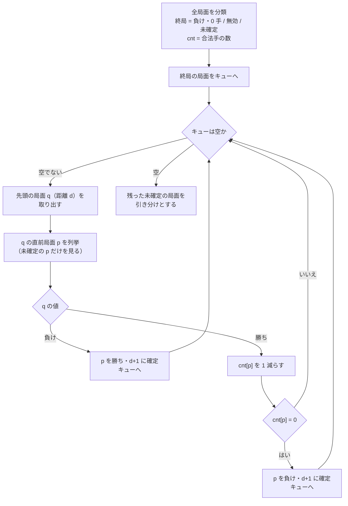

# Neutreeko の強解決 — 説明資料

| 項目 | 内容 |
|---|---|
| 講義 | エージェントシステム特論（千葉工業大学、原英樹先生） |
| 課題 | 最終課題「Neutreeko の強解決をするプログラムおよび説明資料」 |
| リポジトリ | <https://github.com/cyokozai/neutreeko-solver> |
| 実装 | Julia 1.11（標準ライブラリのみ）、パッケージ名 `Neutreeko` |
| 提出者 | （氏名・学籍番号を記入） |

---

## 1. 課題と結論

**Neutreeko の初期局面は引き分けである。** 両者が最善を尽くせば、どちらも 3 つを並べられないまま同じ局面が繰り返される。

この結論は、初期局面を一つ調べて出したものではない。手番側から見た全 3,542,000 局面について、勝ち・負け・引き分けと、決着までの手数（ply）を後退解析で求めた表がある。表は `data/neutreeko_table.bin`（7,084,013 バイト）に保存され、どの局面を与えても値と最善手が一回の表引きで返る。これが強解決の成果物である。計算は 1 秒ほどで終わる（1.09 秒）。

| 問い | 答え |
|---|---|
| 初期局面のゲームの値 | 引き分け |
| 引き分けを保つ初手 | b1-c1、d1-c1 の 2 手だけ（残り 12 手は先手の負け） |
| 最善の応酬で最も長くかかる決着 | 51 ply（勝つ側 26 手、負ける側 25 手） |
| 引き分けの局面の割合 | 有効局面の 3.018% |
| 作者 Haugland の公開値との一致 | 初期局面の値・最長 51 手・引き分け約 3% のすべてで一致 |

引き分けと聞くと、互いに決め手のない穏やかなゲームを想像するかもしれない。ところが、初期局面で黒が指せる 14 手のうち 12 手は、白が正しく応じれば黒の負けに終わる。最短では 2 ply、つまり黒の初手に白が一手返しただけで終局する。引き分けは広い平地ではなく、細い尾根の上にある。

---

## 2. Neutreeko のルール

Neutreeko は Jan Kristian Haugland が 2001 年に発表した二人用のアブストラクトゲームである [1][2]。名前は先行するゲーム Neutron と Teeko の合成で、盤上で駒を滑らせる動きと三目並べの勝ち条件を組み合わせている [2]。

- **盤と駒**: 5×5 の盤。黒と白がそれぞれ 3 駒を持つ。
- **手番**: 黒が先手。以後、交互に自分の駒を 1 つ選んで動かす。
- **動き**: 駒は縦・横・斜めの 8 方向のどれかへ、**他の駒か盤の端にぶつかるまで**まっすぐ滑る。途中で止めることはできない。隣のマスが塞がっている方向へは動けない。
- **勝ち**: 自分の 3 駒を縦・横・斜めのいずれかに**連続して**並べた側の勝ち。
- **引き分け**: 同じ局面が 3 回現れたら引き分け。

### 座標と初期局面

列を左から a〜e、段を下から 1〜5 とする。黒は 1 段目の側から始める。初期局面は黒 b1・d1・c4、白 b5・d5・c2 で、黒の手番である。

```
  5 | .  W  .  W  . |
  4 | .  .  B  .  . |
  3 | .  .  .  .  . |
  2 | .  .  W  .  . |
  1 | .  B  .  B  . |
      a  b  c  d  e
```

黒の b1 を北へ動かすと、b2・b3・b4 と滑り、b5 の白の手前で止まる。この手を `b1-b4` と書く。b1 から北東へは、隣の c2 に白がいるので動けない。同じように数えると、初期局面の黒の合法手は b1 から 4 手、d1 から 4 手、c4 から 6 手の計 14 手になる。

### 局面の文字列表記

実装では局面を `"<手番>:<25文字>"` と書く。手番は `B` か `W`、25 文字は a1, b1, …, e1, a2, …, e5 の順に並べたマスの中身で、`B`（黒）・`W`（白）・`.`（空き）のどれかである。初期局面は `B:.B.B...W.........B...W.W.` になる。後で出てくる局面例もこの表記で書く。

### ルールに書かれていない場合

ルールは「動かせる駒が 1 つもない局面」の扱いを定めていない。実装はこの場合を引数 `no_move_rule` で引き分け（既定）と負けのどちらにも切り替えられるようにしてある。もっとも、全局面を数えると、どちらも並んでいないのに手番側が一手も指せない局面は **0 件**だった（独立実装の検証器でも同じく 0 件）。したがってこの規定の欠けは結果に影響しない（両方の設定で表が完全に一致することもテストで確かめてある）。

---

## 3. ゲームの性質と「解く」の意味

Neutreeko は、講義 #1 で扱った**二人零和有限確定完全情報ゲーム**に当てはまる。

- **二人**: 黒と白の二人で指す。
- **零和**: 一方の勝ちは他方の負けであり、引き分けは両者に等しい。
- **有限**: 盤上の配置は有限（第 4 節で数える）で、同一局面 3 回で引き分けになる規定があるので、どの対局も有限の手数で終わる。
- **確定**: さいころのような偶然の要素がない。
- **完全情報**: 盤上のすべてが両者に見えている。

このクラスのゲームでは、どの局面にも「両者が最善を尽くしたときの結果」が一つに定まる。これがゲームの値で、初期局面の値は先手必勝・後手必勝・引き分けのいずれかになる。ゲームを「解く」とは、この値を求めることだが、どこまで求めるかで三段階に分けられる。

| 区別 | 分かっていること |
|---|---|
| 超弱解決 | 初期局面の値だけ（その値を実現する指し方は示さなくてよい） |
| 弱解決 | 初期局面の値と、初期局面からその値を実現する指し方 |
| 強解決 | **あらゆる局面**の値と、そこからの最善の指し方 |

弱解決なら、初期局面から最善の応酬で現れる局面だけを押さえればよい。強解決では、相手が悪手を指した後の局面も、そもそも初期局面から到達しない局面も含めて、すべての局面に答えを持たなければならない。本課題の実装は、手番側から見た 3,542,000 局面すべてに値と手数を与えるので、強解決にあたる。

ここで一つ引っかかる点がある。引き分けの規定「同じ局面が 3 回」は、盤面だけでなく**それまでの手順**に依存する。厳密には、ゲームの状態は盤面と手番に加えて、各局面が何回現れたかの履歴まで含むことになる。一方、表は盤面と手番だけを添字にしている。履歴を捨てて本当に正しい値が出るのかは、第 5 節の後半で確かめる。

---

## 4. 状態空間

表を作る前に、局面を数え、番号を付ける必要がある。

### 手番側視点への正規化

「黒番で黒がこの配置・白があの配置」という局面と、色を入れ替えた「白番で白がこの配置・黒があの配置」という局面は、指す側から見れば同じゲームである。ルールは色について対称で、色の違いが効くのは「どちらが先手か」だけだからである。そこで局面を、色ではなく**手番側の 3 駒 `me` と相手の 3 駒 `opp`** の組で表す。手番を含めた絶対表現では 7,084,000 通りある局面が、これで半分の 3,542,000 通りになる。

実装では 25 マスを 0〜24 の番号（a1=0, b1=1, …, e5=24）とし、3 駒の集合を 25 ビットのビットボード（`UInt32`）で持つ（`src/board.jl`）。長さ 3 の直線は横 15・縦 15・斜め 9+9 の計 48 本で、これを `WIN_LINES` に列挙してある。

### 組合せ数体系による番号付け

3,542,000 という数は次の積である。

- 手番側の 3 駒を 25 マスに置く方法: C(25,3) = 2,300
- 残り 22 マスに相手の 3 駒を置く方法: C(22,3) = 1,540
- 2,300 × 1,540 = **3,542,000**

この積の形のまま、局面に 1 から 3,542,000 までの番号を隙間なく割り当てる（`src/index.jl` の `rank_state` / `unrank_state`）。

1. 手番側の駒のマス番号を a < b < c とし、組合せ数体系で r_me = C(a,1) + C(b,2) + C(c,3) とする。これは 0〜2,299 の範囲を過不足なく埋める。たとえば a1・b1・c1（0, 1, 2）は 0、a1・b1・d1（0, 1, 3）は 1 になる。
2. 相手の駒は、手番側の駒がいるマスを抜いて 22 マスに詰め直した座標で表す（各マス番号から「それより小さい番号にある手番側の駒の数」を引く）。これに同じ式を当てて r_opp（0〜1,539）とする。
3. 番号は r_me × 1,540 + r_opp + 1。

番号に隙間がないので、表は長さ 3,542,000 の配列そのものになり、ハッシュ表のような探索も無駄な領域も要らない。逆変換 `unrank_state` は、番号順に並べた 3 点集合の表と、「手番側の配置ごとの k 番目の空きマス」の表を引くだけで済む。

### 状態の分類

番号だけでは、盤上にすでに 3 つ並んでいる局面も数に入っている。`state_kind` は局面を三つに分ける。

| 分類 | 条件 | 扱い | 局面数 |
|---|---|---|---|
| 終局 (`:loss0`) | 相手だけが並んでいる | 手番側の負け・0 手 | 72,436 |
| 無効 (`:invalid`) | 手番側が並んでいる（相手の並びは問わない） | 合法な手順では現れない | 73,920 |
| 内部 (`:interior`) | どちらも並んでいない | 値は子局面から決まる | 残り |

手番側がすでに並んでいる局面が「無効」なのは、その並びは手番側が直前の自分の手で作ったもので、その時点で対局は終わっているはずだからである。両者とも並んでいる局面（1,484 通り）も同じ理由で現れない。無効の 73,920 は「手番側だけが並んでいる 72,436」と「両者とも並んでいる 1,484」の和である。以下、全局面から無効を除いた 3,468,080 局面を**有効局面**と呼ぶ。

### 盤面の対称

5×5 の盤は、90° ずつの回転 4 通りと鏡映の組合せで 8 通りの対称変換を持つ（二面体群 D4）。8 方向の滑りも 3 並びもこの変換で形を変えないので、対称な局面どうしは値も手数も等しいはずである。対称で同一視すると、全局面は 443,850 類、有効局面は 434,500 類にまとまる。

表はこの対称で畳んでいない。畳めば 8 分の 1 近くまで縮むが、畳まなくても表は約 7 MB に収まる。対称性は圧縮ではなく、第 6 節の検証に回している。

---

## 5. 後退解析

初期局面から先を読むミニマックス探索（講義 #6〜#8）で、この表は作れるだろうか。

作れそうに思える。ただ、Neutreeko の局面のつながりは木ではなく、循環を含むグラフである。駒を行って戻せば元の局面に戻るので、履歴を持たない深さ優先の探索は終わらない。履歴を持たせれば終わるが、同じ盤面を履歴の数だけ別物として読み直すことになり、探索量が手に負えなくなる。

そこで向きを逆にする。決着のついた局面から出発して、「一手前はどうだったか」を順にさかのぼる。これが後退解析（retrograde analysis）である（講義 #2〜#5）。チェスの終盤データベースを作るために Thompson が用いた手法として知られ [4]、アワリの完全解析のような大規模な例もある [5]。どうぶつしょうぎの完全解析もこの手法に基づく [6]。

### 前向き生成と後ろ向き生成

**前向き生成**（`foreach_move` / `foreach_child`）は、局面 (me, opp) から一手指した子局面を列挙する。me の各駒について 8 方向へ滑らせ、止まったマスへ動かす。子局面では手番が相手に移るので、子の手番側視点は (opp, 動かした後の me) になる。

**後ろ向き生成**（`foreach_predecessor`）は、局面 q = (me, opp) の**直前局面**、つまり一手指すと q になる局面を列挙する。q で直前に指したのは相手側 opp である。相手の駒がマス s にいて、それが方向 d へ滑ってきたのだとすると、二つの条件が立つ。

- s から d へ 1 マス進んだ先は、駒か盤の端で塞がっている。塞がっていなければ、駒は s で止まらずにさらに滑ったはずである。
- 元の位置 t は、s から d の逆向きにたどった連続する空きマスのどれかである。途中に駒があれば、そこを越えて滑ってくることはできない。

```
  方向 d = 東の例（X は s に止まっている相手の駒、# は駒または盤の端）

      t3   t2   t1    s    #
      .    .    .     X    #     ← X は t1・t2・t3 のどこから滑ってきてもよい
```

条件を満たす (s, d, t) のそれぞれが直前局面を一つ与える。直前局面では相手側が手番なので、その手番側視点は (opp から s を除き t を加えたもの, me) になる。滑りは「端まで行く」規則なので、後ろ向きには「どこから来たか」の候補が複数ありうる。ここが、1 マスずつ動く駒のゲームとの違いである。

前向き生成と後ろ向き生成は厳密に逆でなければならない。「p が q の直前局面である」ことと「q が p の子局面である」ことが同値であることは、第 6 節のテストで確かめてある。

### 未解決子数カウンタによる伝播

値の決まり方は二つしかない。

- 子局面に**負け**が一つでもあれば、その手を指せばよいので**勝ち**。
- 子局面が**すべて勝ち**なら、どう指しても相手の勝ちなので**負け**。

一つめは、負けの子が一つ見つかった時点で決まる。二つめは子を全部見るまで決まらない。そこで各局面に「まだ勝ちと確定していない子の数」のカウンタ `cnt` を持たせ、初期値を合法手の数にする。子の一つが勝ちと確定するたびに 1 減らし、0 になったら負けと確定させる。

```
入力: 全局面 i = 1 … 3,542,000
各局面を分類する:
    終局  → value = 負け, dist = 0
    無効  → value = 無効
    内部  → value = 未確定, cnt = 合法手の数
queue ← 終局の局面すべて

while queue が空でない:
    q ← queue の先頭を取り出す;  d ← dist[q]
    for p in 直前局面(q):
        if value[p] ≠ 未確定: continue        # 確定済み・無効・終局は飛ばす
        if value[q] = 負け:
            value[p] ← 勝ち;  dist[p] ← d + 1;  queue の末尾に p を加える
        else:                                  # q は勝ち
            cnt[p] ← cnt[p] − 1
            if cnt[p] = 0:
                value[p] ← 負け;  dist[p] ← d + 1;  queue の末尾に p を加える

未確定のまま残った局面 → 引き分け
```



`src/solve.jl` の `solve()` がこの手順の実装で、キューは長さ 3,542,000 の配列を先頭と末尾の添字で使っている。各局面はキューに高々 1 回しか入らず、取り出した局面ごとに直前局面を一度列挙するだけなので、全体の手間は局面数と手の数の和に比例する。

### 距離（ply）

`dist` は、最善の応酬のもとで決着するまでの手数（ply、片方の一手を 1 と数える）である。勝ちの局面では最短で勝つ手数、負けの局面では最も長く粘ったときの手数になる。

キューは距離の順に処理される。距離 d の局面をすべて処理してから距離 d+1 の局面に進む幅優先の順序なので、勝ちには「最初に見つかった負けの子」、つまり最も近い負けの子から距離が付く。負けには「最後に勝ちと確定した子」、つまり最も遠い勝ちの子から距離が付く。どちらも最善の応酬の定義どおりである。

終局は負け・0 手なので、そこから一段さかのぼるごとに勝ちと負けが入れ替わる。勝ちの距離は必ず奇数、負けの距離は必ず偶数になる。

### 未確定を引き分けとしてよい理由

第 3 節で残した疑問に戻る。表は盤面と手番しか見ていないのに、履歴に依存する「同一局面 3 回」の規定と食い違わないのだろうか。

食い違わない。理由は勝ち負けの局面と、未確定の局面とで分かれる。

**勝ち・負けと確定した局面。** 勝つ側が距離の減る手を選び続けると、負ける側がどう応じても、距離は一手ごとに真に減っていく。距離が真に減り続ける手順は同じ局面を二度通らないので、3 回反復の規定は発動しようがない。負ける側が繰り返しに持ち込んで引き分けに逃げる道もない。

**未確定のまま残った局面。** 未確定の局面の手番側は、負けの子を一つも持たない（持っていれば勝ちと確定したはずである）。同時に、未確定の子を少なくとも一つ持つ（子が全部勝ちなら負けと確定し、合法手 0 の局面はそもそも存在しない）。つまり、どちらの側も相手を終局へ追い込めず、しかも自分は未確定の局面へ逃げ続けられる。両者がそうし続けると、対局は有限個の局面の中を巡り続け、いずれ同じ局面が 3 回現れて引き分けになる。

したがって、履歴を含めた本来のルールのもとでの値は、表の値と一致する。3 回反復の規定は、引き分けの局面で対局を終わらせる役目だけを果たし、勝ち負けの局面には一切関わらない。

---

## 6. 検証

3,542,000 個の値を目で確かめることはできない。表が一見もっともらしくても、後ろ向き生成の一方向の取りこぼしや、カウンタの一回の数え違いがあれば、値は静かに狂う。そこで、壊れ方の種類ごとに、それを捕まえる別々の検査を用意した。すべて `test/` にあり、`make test` で走る。21,185 件がすべて通り、全体で約 28 秒かかる。

### 後退解析と前向き不動点反復の全局面一致

`solve_fixpoint()` は、後ろ向き生成を一切使わずに同じ表を作る別解である。全局面に「子局面の値から一段のミニマックスで値を決める」更新を繰り返し当て、値が変わらなくなるまで続ける。各回の更新は前の回の値だけを読む（Jacobi 型）。j 回目を終えた時点で確定しているのは、ちょうど真の距離が j 以下の局面である。

遅いが、前向きの手の生成だけで動く独立な経路である。二つの表が**全 3,542,000 局面で値も距離も一致した**。後ろ向き生成やカウンタに誤りがあれば、ここで食い違いが出る。

### 局所整合

内部局面のすべてについて、表に書かれた値と距離が、子局面の表の値から一段のミニマックス（`minimax_from_children`）で計算し直した値と一致することを確かめた。不一致は 0 件だった。

この検査は見た目以上に強い。距離まで含めて局所整合が全局面で成り立てば、距離についての帰納法で表全体の正しさが従う。表で距離 d の勝ちとされた局面は、表で距離 d−1 の負けとされた子を持ち、その子が本当に負けであることは帰納法の仮定から言える。逆に、本当は距離 d の勝ちである局面は、本当に距離 d−1 の負けである子を持ち、その子は表でも正しく記されているので、表の値も勝ち・距離 d になる。負けの局面についても同様である。

### 偶奇

勝ちの距離がすべて奇数、負けの距離がすべて偶数であることを全局面で確かめた。

### 8 通りの盤面対称

全局面 × 恒等変換以外の 7 変換について、変換先の値と距離が元と等しいことを確かめた。違反は 0 件。検査関数そのものが働いていることは、1 局面だけ距離をわざと壊した表で違反が検出されることで確かめてある。あわせて、対称類の数を「類の代表元を数える方法」と「各変換の固定点の数の平均（Burnside の補題）」の二通りで求め、一致することを確かめた。

### 番号付けと手の生成

- **rank/unrank の往復**: 全 3,542,000 番号について、`unrank_state` で局面に戻し、`rank_state` で番号に戻すと元に戻る。戻した局面は各 3 駒で重なりがない。
- **predecessors と legal_moves の整合**: 無作為に選んだ 10 万局面について、「子局面の直前局面に元の局面が含まれる」「直前局面の子局面に元の局面が含まれる」の両方向を確かめた。さらに全局面で「子局面の総数」と「直前局面の総数」が等しい（どちらも手の総数に一致する）ことを確かめた。
- **勝ち筋**: 48 本の勝ち筋の判定を、全 C(25,3) = 2,300 通りの 3 マスの組について、テスト側で独立に書いた幾何的な判定と突き合わせた。
- **初期局面の合法手**: 手で数えた 14 手と一致する。

このほか、表の保存と読込の往復、壊れたファイルの拒否、無作為な 2 万局面での最善手の性質、最長の勝ち局面から最善手順どおりに指すと表の距離ちょうどで勝つこと、初期局面からの到達可能な局面の集合がもう一つの数え方と一致すること、などを確かめている。

### 独立実装の αβ 検証器との突き合わせ

> **（検証器の結果で更新）** この小節は、独立に実装した αβ 検証器（`verify/`、作業中）の結果で埋める。以下の数値はまだ確定していない。

ここまでの検査は、どれも同じ作者が同じ盤の表現の上に書いたものである。盤の表現やルールの読み違いそのものが共通していれば、すべての検査を素通りしうる。そこで、本体のパッケージを使わずにルールを一から実装し、共有するのは第 2 節の局面文字列だけ、という方針の検証器を別に用意する。検証器は局面文字列を受け取り、深さ制限つきの αβ 探索（反復深化）で「何手以内に勝てるか・負けるか」を求め、表の値と距離に突き合わせる。探索は履歴を持たない。第 5 節で見たとおり、勝ち負けの距離は 3 回反復の規定に左右されないからである。

| 項目 | 値 |
|---|---|
| 照合する局面の選び方 | （検証器の結果で更新） |
| 照合した局面数 | （検証器の結果で更新） |
| 一致 / 不一致 | （検証器の結果で更新） |
| 探索の深さ・打ち切り条件 | （検証器の結果で更新） |
| 所要時間 | （検証器の結果で更新） |

---

## 7. 結果と考察

### 全局面の値

| 区分 | 局面数 | 有効局面に対する割合 |
|---|---:|---:|
| 全局面（手番側視点） | 3,542,000 | — |
| （参考）手番込みの絶対表現 | 7,084,000 | — |
| 無効（手番側が並び済み） | 73,920 | — |
| **有効局面** | **3,468,080** | 100% |
| 勝ち | 2,473,028 | 71.308% |
| 負け | 890,392 | 25.674% |
| 負けのうち終局（0 手） | 72,436 | — |
| 引き分け | 104,660 | 3.018% |

| 項目 | 値 |
|---|---|
| 最長の勝ち距離 | 51 ply（該当 8 局面） |
| 最長の負け距離 | 50 ply |
| 合法手 0 の局面 | 0 |
| 対称類の数（8 変換） | 全局面 443,850 / 有効 434,500 / 引き分け 13,114 |
| 対称性の違反 | 0 |
| 後退解析の所要時間 | 1.09 秒 |
| 表のファイル | 7,084,013 バイト |

有効局面の 7 割強は、手番側の勝ちである。駒を動かせることは、このゲームではほとんどの場合に得になる。引き分けは 3% ほどしかない。

### 初期局面から到達できる局面

表は有効局面のすべてを解いているが、そのうち初期局面から実際に現れうる局面はどれだけあるのか。初期局面から合法手順（どちらかが並んだら終局）で幅優先にたどった結果は次のとおりである。

| 項目 | 局面数 |
|---|---:|
| 到達可能（手番込みの絶対表現） | 6,935,248 |
| 到達可能（手番側視点） | 3,467,624 |
| そのうち終局 | 72,364 |
| そのうち引き分け | 104,648（3.018%） |
| 有効だが到達不能 | 456 |

有効局面のうち初期局面から届かないのは 456 局面だけで、ほぼ全域に手が届く。到達不能な局面は、どちらも並んでいない直前局面を一つも持たない局面で、「一手前に対局が続いていた」ことがありえない配置である。引き分けの割合は、到達可能な局面に限っても 3.018% で変わらない。どうぶつしょうぎの完全解析は初期局面から到達可能な局面を対象にしている [6] が、Neutreeko ではこの区別はほとんど結果を変えない。

### 初手 14 手

初期局面は引き分けで、引き分けを保つ初手は b1-c1 と d1-c1 の 2 手だけである。括弧内は、その初手を指した後、両者最善で決着するまでの初期局面からの手数（ply）である。

| 初手 | 黒から見た結果 | 初手 | 黒から見た結果 |
|---|---|---|---|
| b1-b4 | 負け（22） | d1-d4 | 負け（22） |
| **b1-c1** | **引き分け** | **d1-c1** | **引き分け** |
| b1-a1 | 負け（6） | d1-e1 | 負け（6） |
| b1-a2 | 負け（10） | d1-e2 | 負け（10） |
| c4-c5 | 負け（4） | c4-c3 | 負け（4） |
| c4-e4 | 負け（2） | c4-a4 | 負け（2） |
| c4-e2 | 負け（2） | c4-a2 | 負け（2） |

表は左右に対になるよう並べてある。初期局面は a 列と e 列を入れ替える鏡映で自分自身に移るので、b1 の手と d1 の手は鏡映の組になり、結果も組ごとに等しい。引き分けを保つ 2 手も鏡映の組で、実質的には「1 段目の駒の一つを c1 へ寄せる」という一通りの手しかない。

この細さは初手だけで終わらない。引き分けを保つ手順をたどると、2 ply 目から 15 ply 目までは、どの局面でも引き分けを保つ手がちょうど 1 つしかない。16 ply 目で初めて 5 手に広がる（この段落の数値は、本資料のために表から追加で計算したもの）。作者の Haugland は、初期局面から序盤 15 手を正しく指す方法は実質的に一通りしかないと述べている [1]。表から読み取れる序盤の形は、この記述と合っている。

最も早く負けるのは c4 を横や斜めへ動かす 4 手で、2 ply で終局する。c4 の黒は、c2 の白が北へ滑る道をふさいでいる。これがどけば、白は c2 から c3・c4 を抜けて c5 まで滑り、b5・c5・d5 の横一列が完成する。c4 を縦に動かす c4-c5 と c4-c3 は道をふさいだままなので、負けまで 4 ply と少しだけ延びる。

### 最長 51 ply の局面

最善の応酬で最も長くかかる決着は 51 ply で、そうなる局面は 8 つある。そのうちの一つ `B:BW.B...W...B........W....`（黒 a1・d1・b3、白 b1・c2・a5、黒番）を示す。黒の勝ちで、黒が 26 手、白が 25 手を指して終わる。

```
  開始局面（黒番）            終局（51 ply 後、白番）
  5 | W  .  .  .  . |         5 | B  .  W  .  . |
  4 | .  .  .  .  . |         4 | B  W  .  .  . |
  3 | .  B  .  .  . |         3 | B  .  .  .  . |
  2 | .  .  W  .  . |         2 | .  .  .  .  . |
  1 | B  W  .  B  . |         1 | .  .  .  .  W |
      a  b  c  d  e               a  b  c  d  e
```

最善手順（奇数番目が黒、偶数番目が白）:

```
  1–10 : a1-a4 a5-e5 a4-e4 e5-a1 d1-c1 b1-b2 c1-b1 c2-d3 b3-c3 d3-c2
 11–20 : e4-d3 a1-a5 c3-a3 a5-e5 d3-e3 b2-c1 e3-e4 e5-a1 e4-d5 a1-a2
 21–30 : a3-c5 a2-b2 d5-a2 c2-e4 c5-a3 b2-a1 a3-e3 e4-c2 e3-c5 c2-b2
 31–40 : a2-d5 c1-c4 b1-e4 b2-e5 e4-e1 c4-b5 d5-a2 e5-e2 c5-c1 b5-d3
 41–50 : e1-d1 a1-b1 a2-a5 e2-e1 d1-a4 d3-a3 a4-b5 a3-c5 c1-a3 b1-b4
 51    : b5-a4
```

最後の b5-a4 で、黒は a3・a4・a5 の縦一列を完成させる。黒の 1 手目 a1-a4 の後、白から見た局面は負け・50 ply で、これが最長の負け距離 50 ply にあたる。

### 公開値との照合

| 項目 | 公開値 | 本実装 | 判定 |
|---|---|---|---|
| 初期局面の値 [1] | 引き分け（neutral） | 引き分け | 一致 |
| 最善で最も長い決着 [1] | 51 手（一方 26 手、他方 25 手） | 最長の勝ち距離 51 ply | 一致 |
| 引き分けの局面の割合 [1] | 合法な局面の約 3% | 有効局面の 3.018%（到達可能な局面でも 3.018%） | 一致 |
| valid board positions [3] | 3,450,516 | 該当する集計なし | 再現できず |

Haugland の三つの値とは、すべて一致した [1]。「51 手」は双方の手を合わせた数で、本実装の 51 ply と同じ数え方である。

g-dv によるブラウザ版の実装 [3] は、README で valid board positions を 3,450,516 としている。この数は再現できなかった。有効局面 3,468,080、到達可能な局面 3,467,624（手番込みでは 6,935,248）、全局面 3,542,000 のいずれとも合わない。

一番近いのは、手番を無視した駒の配置 3,542,000 通りから、両者とも並んでいる 1,484 通りを除いた **3,540,516** である。3,450,516 と比べると、上から 2 桁目と 3 桁目の「4」と「5」が入れ替わっているだけで、他の桁はすべて同じである。README に書き写す際の誤りではないかと**推測**するが、先方の集計手順は公開されておらず、確かめてはいない。

---

## 8. エージェントとしての位置づけ

> **（実装担当の結果で更新）** この節のエージェントは別担当が実装中である。ここには枠と方針だけを置く。

講義の意味でのエージェントは、環境（盤面と手番）を知覚し、行為（指し手）を選んで環境に返すものである。強解決の表は、それ自体はエージェントではないが、最善の行為を即座に返せる知識である。表を持つ場合と持たない場合で、二つのエージェントを用意する。

**完全エージェント（表を引く）。** 局面を受け取り、`best_moves` で最善手を返す。

- 勝ちの局面では、最短で勝てる手（子局面が「負け・距離 d−1」になる手）を選ぶ。
- 負けの局面では、最も長く粘れる手（子局面が「勝ち・距離 d−1」になる手）を選ぶ。
- 引き分けの局面では、引き分けを保つ手を選ぶ。
- 候補が複数あるときの選び方: （実装担当の結果で更新）

**深さ制限 αβ エージェント（表を引かない）。** 講義 #6〜#8 の αβ 法で、決められた深さまで先読みし、読み切れない局面は評価関数で見積もる。

- 評価関数と探索の深さ: （実装担当の結果で更新）

**比べ方の方針。** 完全エージェントは負けない基準点になる。深さ制限 αβ エージェントを、初期局面からの対局と、表から選んだ局面からの対局で完全エージェントと戦わせ、深さを変えたときに引き分けを保てるか、勝ちの局面を勝ち切れるかを調べる。表があるので、αβ エージェントの一手一手が最善手だったかどうかも局面ごとに判定できる。

| 対戦 | 条件 | 結果 |
|---|---|---|
| αβ（深さ k）対 完全 | 初期局面から | （実装担当の結果で更新） |
| αβ（深さ k）対 完全 | 表から選んだ局面から | （実装担当の結果で更新） |
| αβ の最善手一致率 | 深さ別 | （実装担当の結果で更新） |

---

## 9. 実行方法

ホストに Julia を入れる必要はない。Docker（Compose v2）と `make` があればよい。

```sh
git clone git@github.com:cyokozai/neutreeko-solver.git
cd neutreeko-solver

make test       # Pkg.test() を実行（21,185 件、約 28 秒）
make verify     # 独立検証器 verify/runtests.jl を実行（まだ無ければ skip）
make solve      # 強解決して data/neutreeko_table.bin を作り、統計を出力
make shell      # リポジトリをマウントした bash を開く
make help       # ターゲット一覧
```

- `make solve ARGS="--no-move=loss"` とすると、合法手 0 の局面を負けとして解く（件数が 0 なので表は変わらない）。表は `data/neutreeko_table_nomove_loss.bin` に保存される。
- `test` / `verify` / `solve` はイメージに焼き込んだコードで動き、`data/` だけがホストにマウントされる。`make` はコードの変更に合わせてイメージを作り直す。
- `make` を使わない場合は `docker compose run --rm --build solve` のように直接呼ぶ。
- 片付けは `make clean`（`data/` は残る）。

表を使って局面を調べるには、`make shell` で入ったコンテナの中で次のようにする。

```julia
# julia --project=.
using Neutreeko
t = load_table("data/neutreeko_table.bin")
p = parse_position("B:.B.B...W.........B...W.W.")   # 初期局面
lookup(t, p)       # (:draw, -1)   値と、決着までの手数（引き分けは -1）
best_moves(t, p)   # b1-c1, d1-c1
```

`lookup` は手番側から見た値（`:win` / `:loss` / `:draw` / `:invalid`）と手数を返す。勝ちは最短、負けは最長の手数で、引き分けと無効では -1 になる。

---

## 10. 参考文献

1. J. K. Haugland, "Neutreeko," <https://www.neutreeko.net/neutreeko.htm>（2026-09-24 閲覧）
2. じゃんご, 「Neutreeko 【ルール】」, じゃんごの「誰かこのゲームやってくれ！」, 2013-03-30. <http://djangorec.blog.fc2.com/blog-entry-1.html>（2026-09-24 閲覧）
3. g-dv, "neutreeko," GitLab. <https://gitlab.com/g-dv/neutreeko>（2026-09-24 閲覧）
4. K. Thompson, "Retrograde Analysis of Certain Endgames," *ICCA Journal*, vol. 9, no. 3, pp. 131–139, 1986. DOI: [10.3233/ICG-1986-9302](https://doi.org/10.3233/ICG-1986-9302)
5. J. W. Romein and H. E. Bal, "Solving Awari with Parallel Retrograde Analysis," *IEEE Computer*, vol. 36, no. 10, pp. 26–33, 2003. DOI: [10.1109/MC.2003.1236468](https://doi.org/10.1109/MC.2003.1236468)
6. 田中哲朗, 「「どうぶつしょうぎ」の完全解析」, 情報処理学会研究報告ゲーム情報学（GI）, 2009-GI-22, No. 3, pp. 1–8, 2009. <https://ipsj.ixsq.nii.ac.jp/records/62415>
7. J. Considine, "Compressed Game Solving," in *Computers and Games (CG 2024)*, Lecture Notes in Computer Science, Springer, pp. 79–90, 2025. DOI: [10.1007/978-3-031-86585-5_7](https://doi.org/10.1007/978-3-031-86585-5_7)（arXiv:2411.07273）
8. T. Kaneko and S. Yamashita, "Strongly Solving 2048 4x3," arXiv:2510.04580, 2025. <https://arxiv.org/abs/2510.04580>

強解決は、小さなゲームでは今も研究の対象になっている。解の表そのものを圧縮して持つ試み [7] や、確率的な要素を含む 2048 の縮小版の強解決 [8] がその例である。一方、Neutreeko の強解決を主題にした査読論文は、2026 年 9 月に Web 検索で調べた範囲では見当たらなかった。Neutreeko の解析結果の出典は、作者のページ [1] の記述に頼っている。
